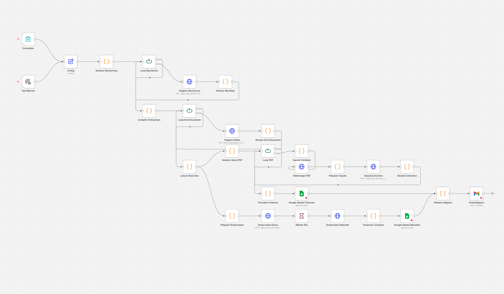

# Pipeline d'Acquisition — Transport & Logistique France

Pipeline n8n pour identifier, enrichir et scorer des PME françaises de transport et logistique, dans le cadre d'une recherche de cibles d'acquisition. Mission ponctuelle pour un client.



## Le besoin

Quelqu'un en recherche de cibles d'acquisition dans le transport-logistique m'a contacté. Il voulait une liste qualifiée d'entreprises à approcher, avec leurs comptes sociaux, le nom du dirigeant, et un email direct. Il faisait ce travail à la main — Google Maps, puis Pappers, puis LinkedIn, puis enrichissement email — ça lui prenait plusieurs jours par run et c'était impossible à reproduire d'une zone à l'autre.

L'idée était de remplacer ce process manuel par un pipeline qu'il pouvait relancer lui-même.

## Le pipeline

```
[1] Google Maps Text Search   ←   48 villes × 10 mots-clés
        ↓ déduplication par place_id
[2] Google Maps Place Details ←   téléphone, site web
        ↓
[3] Pappers API               ←   SIREN, NAF, CA, dirigeant
        ↓ filtre codes NAF transport/logistique uniquement
[4] Dropcontact               ←   email du dirigeant si site web
    ou URL recherche LinkedIn ←   sinon
        ↓
[5] Scoring 0–100 → Google Sheet par région + Excel + email
```

33 nœuds n8n au total. Chaque étape a un `splitInBatches` et un `wait` pour respecter les rate limits sans coder de retry. Tous les appels HTTP en `continueOnFail` : sur 2 500 entreprises traitées, quelques échecs ponctuels d'API ne doivent pas faire perdre les 2 495 résultats valides.

## Scoring

| Critère | Points |
|---|---|
| CA entre 1 M€ et 50 M€ | +30 |
| Effectif 10–250 salariés | +20 |
| Entreprise créée avant 2005 | +20 |
| Résultat net positif | +15 |
| Site web présent | +5 |
| Email dirigeant trouvé | +10 |

Trois catégories en sortie : **Cible Prioritaire** (≥ 70), **À Qualifier** (40–69), **Faible Potentiel** (< 40). Seuils calibrés avec le client sur un échantillon manuel de 50 entreprises avant de lancer le run complet.

## Coût d'un run complet

Pour 480 combinaisons et ~2 500 entreprises traitées :

| Service | Volume | Coût |
|---|---|---|
| Google Maps | ~4 000 requêtes | ~90 $ |
| Pappers (plan Pro) | ~2 500 requêtes | inclus, 49 €/mois |
| Dropcontact | 500–800 enrichissements | inclus, 24 €/mois |

## Stack

n8n self-hosted (Docker), Google Maps Places API, Pappers, Dropcontact, Google Sheets + Excel, Gmail pour le rapport final.
